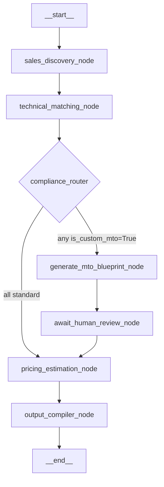

# FMCG Production Backend — Implementation Plan

Build the complete Python backend layer: state schemas, Supabase client, 7-node LangGraph workflow with human-in-the-loop, and a FastAPI Vercel serverless gateway.

---

## User Review Required

> [!IMPORTANT]
> **Environment Variable Naming Mismatch** — Your [.env](file:///d:/FMCG/.env) currently defines:
> - `NEXT_PUBLIC_SUPABASE_URL` / `NEXT_PUBLIC_SUPABASE_PUBLISHABLE_KEY`
>
> But the spec calls for the backend to read:
> - `SUPABASE_URL` / `SUPABASE_SERVICE_KEY`
>
> **Plan:** The backend `client.py` will read `SUPABASE_URL` and `SUPABASE_SERVICE_KEY` as specified. You will need to add these two variables to your `.env` (the `NEXT_PUBLIC_*` variants are for the frontend React layer and use the anon/publishable key, while the backend should use the **service role key** for elevated access). I will **not** modify your `.env` automatically.

> [!WARNING]
> **`MemorySaver` is RAM-only** — The `MemorySaver` checkpointer persists state only within the running Python process. On Vercel Serverless, each request can land on a cold-start instance, meaning **cross-request state resume will not work reliably in production**. This is fine for local development and testing. For production Vercel deployment, you would need a persistent checkpointer (e.g., `PostgresSaver` backed by your Supabase PostgreSQL). I will use `MemorySaver` as specified and leave a documented upgrade path.

> [!IMPORTANT]
> **Vercel Serverless Cold Start & Long-Running Workflows** — Vercel functions have a max execution timeout (10s on Hobby, 60s on Pro). The LangGraph `.stream()` call that runs multiple LLM nodes sequentially may exceed this. The plan proceeds as specified (it will work locally with `uvicorn`), but for production you may need to move to a persistent backend host (Railway, Fly.io) or break into async steps.

## Open Questions

1. **Supabase Service Key** — Do you have a Supabase **service role key** (starts with `eyJ...`)? The publishable key in `.env` has restricted permissions and cannot perform server-side vector operations. If you don't have it yet, you can find it in the Supabase Dashboard → Settings → API → `service_role` key.

2. **Supabase Table Schema** — The `technical_matching_node` simulates a vector search. Do you want me to include a real `supabase.rpc("match_products", ...)` call structure that assumes a pre-existing `products` table with a `vector` column, or keep the simulation logic as specified (hardcoded 65% match for >600V)?

3. **GROQ_API_KEY naming** — Your `.env` has `GROQ_API_KEY`. The `langchain-groq` package automatically reads this env var by convention, so no explicit passing is needed. Confirming this is intentional and correct.

---

## Proposed Changes

### Component 1: Project Scaffolding & Dependencies

#### [NEW] [\_\_init\_\_.py](file:///d:/FMCG/backend/api/__init__.py)
Empty module init to make `api/` a Python package.

#### [NEW] [\_\_init\_\_.py](file:///d:/FMCG/backend/api/database/__init__.py)
Empty module init for `database/` subpackage.

#### [NEW] [\_\_init\_\_.py](file:///d:/FMCG/backend/api/graph/__init__.py)
Empty module init for `graph/` subpackage.

#### [NEW] [pyproject.toml](file:///d:/FMCG/backend/pyproject.toml)
- Python `>=3.12` requirement
- Dependencies: `fastapi`, `uvicorn[standard]`, `langgraph`, `langchain-groq`, `supabase`, `pydantic>=2.0`
- Managed by `uv`

#### [NEW] [requirements.txt](file:///d:/FMCG/backend/requirements.txt)
- Auto-derived flat dependency list for Vercel's `@vercel/python` builder (Vercel reads `requirements.txt` from the project root or build source)

#### [NEW] [vercel.json](file:///d:/FMCG/vercel.json)
- Routes all `/api/*` traffic to `backend/api/index.py`
- Configures `@vercel/python` builder for the backend
- Preserves future frontend static build routing

---

### Component 2: State Schemas — `state.py`

#### [NEW] [state.py](file:///d:/FMCG/backend/api/graph/state.py)

Three `TypedDict` definitions with strict typing:

| Type | Fields | Notes |
|---|---|---|
| `RFPRequirement` | `line_item_id: str`, `raw_specification_string: str`, `core_count: int`, `conductor_material: str`, `voltage_rating: float`, `insulation_type: str` | Individual parsed requirement line from the RFP |
| `SKURecommendation` | `sku_id: str`, `product_name: str`, `spec_match_percentage: float`, `is_custom_mto: bool`, `gap_analysis_notes: str` | Per-requirement SKU match result |
| `RFPState` | `raw_rfp_content: str`, `metadata: dict[str, str]`, `extracted_requirements: list[RFPRequirement]`, `matched_skus: list[SKURecommendation]`, `mto_blueprints: list[str]`, `pricing_breakdown: list[dict[str, float]]`, `commodity_volatility_multiplier: float`, `human_override_notes: Optional[str]`, `final_proposal_markdown: str` | Global graph state — single source of truth across all nodes |

**Design Decisions:**
- Using `TypedDict` (not Pydantic `BaseModel`) as LangGraph's `StateGraph` natively expects dict-like state schemas for merge semantics.
- `Optional` used only for `human_override_notes` since it's populated only after human review.
- `commodity_volatility_multiplier` defaults to `1.0` at initialization (no price adjustment by default).

---

### Component 3: Database Client — `client.py`

#### [NEW] [client.py](file:///d:/FMCG/backend/api/database/client.py)

- Reads `SUPABASE_URL` and `SUPABASE_SERVICE_KEY` from `os.environ`
- Validates both are present and non-empty; raises `RuntimeError` with a clear diagnostic message if either is missing
- Calls `supabase.create_client(url, key)` and exports the initialized `Client` instance
- Module-level singleton pattern — imported once, reused across nodes

```python
# Pseudostructure (actual code will be fully executable):
url = os.environ.get("SUPABASE_URL")
key = os.environ.get("SUPABASE_SERVICE_KEY")
if not url or not key:
    raise RuntimeError("Missing SUPABASE_URL or SUPABASE_SERVICE_KEY")
supabase_client: Client = create_client(url, key)
```

---

### Component 4: Multi-Agent Workflow — `workflow.py`

#### [NEW] [workflow.py](file:///d:/FMCG/backend/api/graph/workflow.py)

This is the core file. It constructs a `StateGraph(RFPState)` with **7 nodes** and **1 conditional router**.

#### Graph Topology (visual):



#### Node Implementation Details:

**Node 1: `sales_discovery_node`**
- Constructs a structured prompt with the raw RFP text
- Invokes `ChatGroq(model="llama-3.3-70b-versatile", temperature=0)` 
- Prompt instructs the LLM to extract requirements as a JSON array matching `RFPRequirement` schema
- Parses JSON response, validates structure, returns `{"extracted_requirements": [...], "metadata": {...}}`
- `GROQ_API_KEY` is read automatically by `langchain-groq` from environment

**Node 2: `technical_matching_node`**
- Iterates over `extracted_requirements` from state
- For each requirement: simulates vector search (as specified)
- **Edge case logic**: If `voltage_rating > 600`, sets `spec_match_percentage = 65.0` and `is_custom_mto = True`
- Otherwise: sets `spec_match_percentage = 92.5` and `is_custom_mto = False`
- Returns `{"matched_skus": [...]}`

**Node 3: `compliance_router` (conditional edge function)**
- Not a node — implemented as a function passed to `add_conditional_edges()`
- Reads `matched_skus` from state
- Returns `"generate_mto_blueprint"` if `any(sku["is_custom_mto"] for sku in matched_skus)`
- Returns `"pricing_estimation"` otherwise

**Node 4: `generate_mto_blueprint_node`**
- Filters `matched_skus` for items where `is_custom_mto == True`
- For each MTO item, constructs a prompt asking ChatGroq to produce a markdown engineering modification profile (e.g., insulation extrusion thickening for 1100V)
- Returns `{"mto_blueprints": [markdown_string, ...]}`

**Node 5: `await_human_review_node`**
- Calls `interrupt()` with a structured dict payload:
  ```python
  interrupt({
      "alert": "MTO Blueprint Review Required",
      "blueprints": state["mto_blueprints"],
      "current_multiplier": state["commodity_volatility_multiplier"]
  })
  ```
- When resumed via `Command(resume=user_input)`, the `interrupt()` call returns the user input
- Extracts `human_override_notes` and `commodity_volatility_multiplier` from the returned value
- Returns state update with both fields

**Node 6: `pricing_estimation_node`**
- Iterates `matched_skus`, assigns a base price per SKU (simulated)
- Multiplies each base price by `commodity_volatility_multiplier`
- Returns `{"pricing_breakdown": [{"sku_id": ..., "base_price": ..., "adjusted_price": ..., "multiplier": ...}, ...]}`

**Node 7: `output_compiler_node`**
- Concatenates into a structured markdown document:
  - Header with metadata
  - Technical Requirements Matrix (table)
  - SKU Matching Results (table with match %, MTO flags)
  - MTO Blueprints section (if any)
  - Pricing Breakdown (table)
  - Human Override Notes (if any)
- Returns `{"final_proposal_markdown": compiled_string}`

**Graph Compilation:**
```python
from langgraph.checkpoint.memory import MemorySaver

memory = MemorySaver()
rfp_workflow = graph_builder.compile(checkpointer=memory)
```

---

### Component 5: FastAPI Gateway — `index.py`

#### [NEW] [index.py](file:///d:/FMCG/backend/api/index.py)

| Endpoint | Method | Purpose |
|---|---|---|
| `/api/process-rfp/start` | POST | Accept `thread_id` + `rfp_text`, stream graph, catch interrupt, return `PAUSED_FOR_HUMAN_REVIEW` with blueprint payload |
| `/api/process-rfp/resume` | POST | Accept `thread_id` + `adjusted_volatility` + `notes`, resume with `Command(resume=...)`, return final markdown |

**Implementation Details:**

- `FastAPI()` instance with CORS middleware: `allow_origins=["*"]`, `allow_methods=["*"]`, `allow_headers=["*"]`
- Request/Response models using Pydantic `BaseModel`:
  - `StartRequest(thread_id: str, rfp_text: str)`
  - `ResumeRequest(thread_id: str, adjusted_volatility: float, notes: str)`
  - `StartResponse(status: str, thread_id: str, blueprint_payload: list[str])`
  - `FinalResponse(status: str, thread_id: str, final_proposal_markdown: str)`

**`/api/process-rfp/start` logic:**
```python
config = {"configurable": {"thread_id": request.thread_id}}
initial_state = {"raw_rfp_content": request.rfp_text, ...defaults...}
blueprint_payload = []
for event in rfp_workflow.stream(initial_state, config=config):
    if "__interrupt__" in event:
        # Extract the interrupt value (our blueprint alert dict)
        blueprint_payload = event["__interrupt__"][0].value["blueprints"]
return StartResponse(
    status="PAUSED_FOR_HUMAN_REVIEW",
    thread_id=request.thread_id,
    blueprint_payload=blueprint_payload
)
```

**`/api/process-rfp/resume` logic:**
```python
config = {"configurable": {"thread_id": request.thread_id}}
resume_value = {
    "human_override_notes": request.notes,
    "commodity_volatility_multiplier": request.adjusted_volatility
}
final_markdown = ""
for event in rfp_workflow.stream(Command(resume=resume_value), config=config):
    if "output_compiler_node" in event:
        final_markdown = event["output_compiler_node"]["final_proposal_markdown"]
return FinalResponse(
    status="COMPLETED",
    thread_id=request.thread_id,
    final_proposal_markdown=final_markdown
)
```

**Vercel Handler:**
- The FastAPI `app` instance at module scope is automatically detected by `@vercel/python`
- No `if __name__ == "__main__"` uvicorn block needed for Vercel, but I'll include one guarded for local development

---

## File Manifest (8 files total)

| # | File | Purpose | Lines (est.) |
|---|---|---|---|
| 1 | `backend/api/__init__.py` | Package init | 1 |
| 2 | `backend/api/database/__init__.py` | Package init | 1 |
| 3 | `backend/api/graph/__init__.py` | Package init | 1 |
| 4 | `backend/api/graph/state.py` | TypedDict state schemas | ~45 |
| 5 | `backend/api/database/client.py` | Supabase client singleton | ~25 |
| 6 | `backend/api/graph/workflow.py` | 7-node LangGraph workflow | ~250 |
| 7 | `backend/api/index.py` | FastAPI serverless gateway | ~110 |
| 8 | `backend/pyproject.toml` | Python project config (uv) | ~25 |
| 9 | `backend/requirements.txt` | Vercel dependency list | ~10 |
| 10 | `vercel.json` | Monorepo deployment router | ~25 |

---

## Verification Plan

### Automated Tests
1. **Syntax validation** — Run `python -c "from api.graph.state import RFPState; from api.graph.workflow import rfp_workflow; from api.index import app"` from `backend/` to verify all imports resolve
2. **Type checking** — Run `python -m py_compile` on each `.py` file
3. **Local server smoke test** — Start `uvicorn api.index:app --reload --port 8000` from `backend/` directory and test both endpoints with `curl`

### Manual Verification
1. POST to `/api/process-rfp/start` with sample RFP text → expect `PAUSED_FOR_HUMAN_REVIEW` response with blueprint data
2. POST to `/api/process-rfp/resume` with the same `thread_id` → expect `COMPLETED` response with full markdown proposal
3. Verify the interrupt/resume cycle works end-to-end by checking that `human_override_notes` and adjusted pricing appear in the final output
